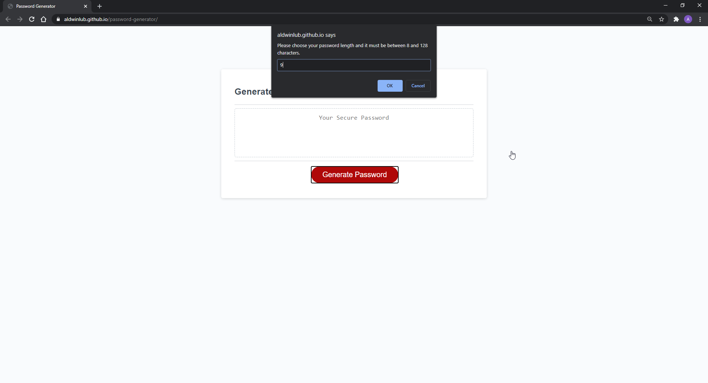
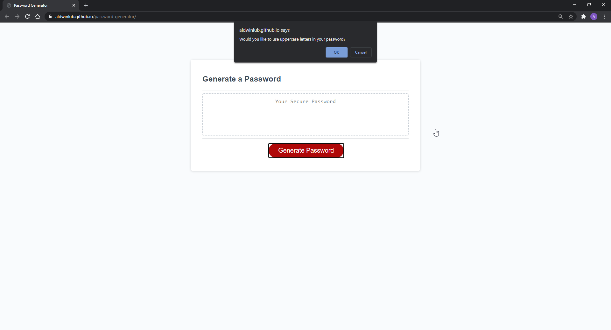
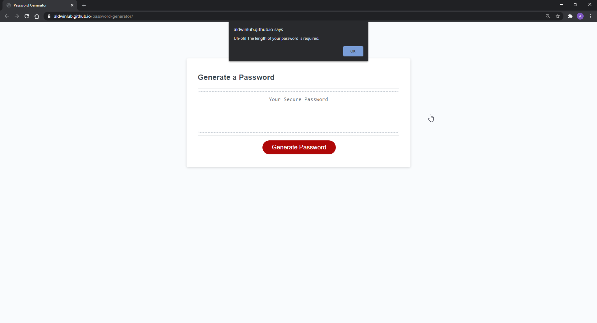
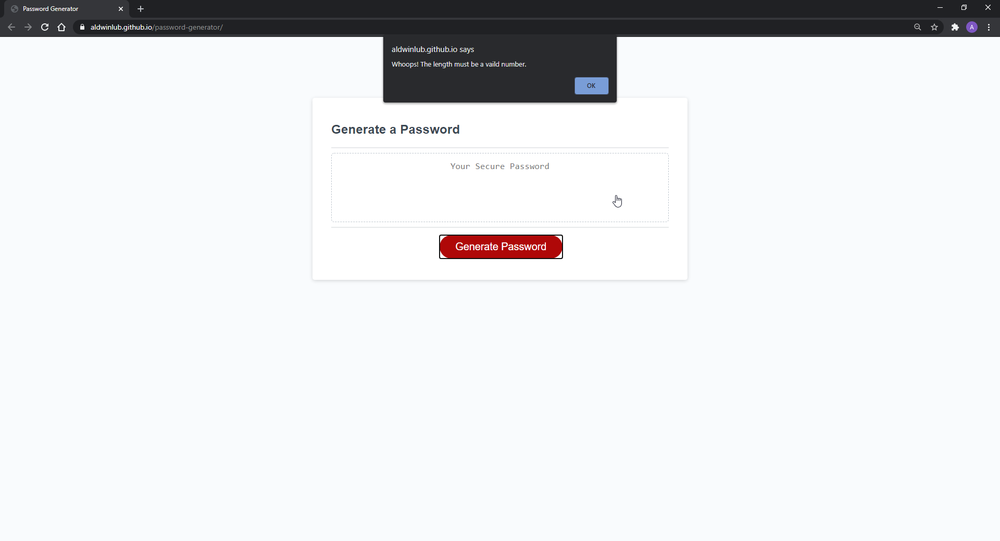
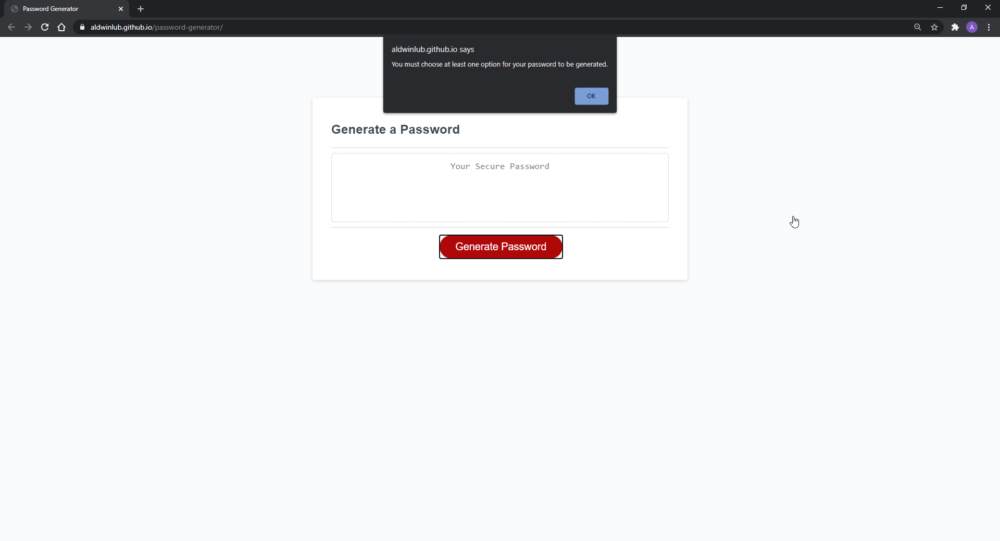
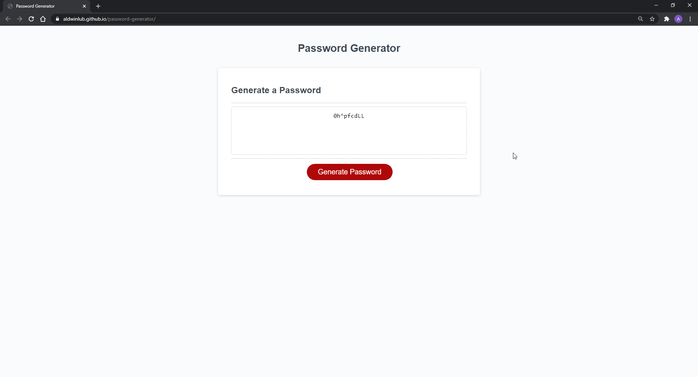
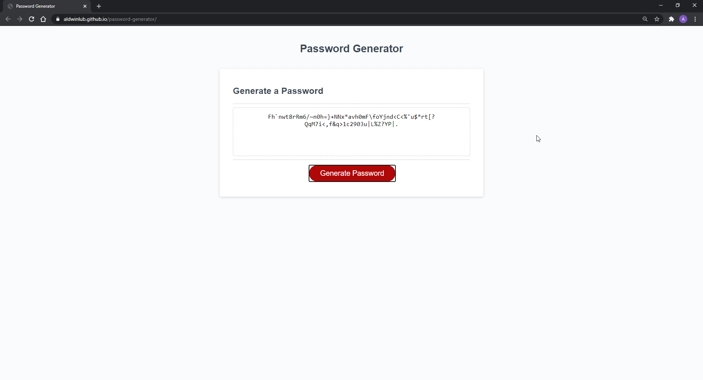

# password-generator

## An Overview

In this assignment, we were given preexisting code where the html and css were already created. It structured a website where users can generate a random password upon user input. What I managed to accomplish through JavaScript was being able to prompt the user to input a value to choose how long they wanted their password to be and to choose what kind of characters they wanted to include as well. This was accomplished through various arrays and strings, if and if else statements, a for loop, creating functions, and finally calling those functions. I tried my best to comment on what or why certain code was included.

## Here is a link to my GitHub Pages

## Screenshots!
Here is a snippet of the completed password generator and a prompt once the "Generate Password" button has been clicked:

Here are the different confirms that the user has to choose from (at least one option is needed) once the length of the password has been chosen (between 8 to 128 characters):

Here are the different error messages that the user can recieve if inputs are invalid:

Here are some examples of randomly genereated passwords with different character lengths:

